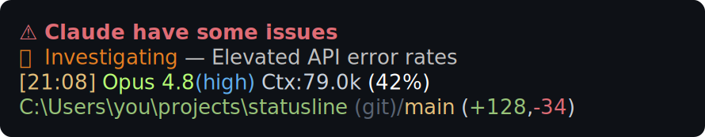

# Usage-aware Claude statusline

**A usage-aware status line for [Claude Code](https://code.claude.com)** — token usage, weekly rate-limit resets, context window, git, and weather, in a fully template-driven multi-line bar.


Most Claude Code status lines show the model and a token count. This one puts your **actual consumption** in front of you after every turn: context-window fill with a 1/8-cell-precise gauge, **session and weekly rate-limit usage with reset countdowns**, input/output/cached token counts — plus the niceties (git branch & diff, current path, live weather and sunrise/sunset). The runtime is **pure Python standard library** (no `pip install`), and a **Textual TUI editor** lets you build the layout visually.

---

## Contents

- [Why this one?](#why-this-one)
- [Examples](#examples)
- [Requirements](#requirements)
- [Install](#install)
- [Configuration](#configuration)
- [The TUI editor](#the-tui-editor)
- [Skills](#skills)
- [Troubleshooting / FAQ](#troubleshooting--faq)
- [How it compares](#how-it-compares)
- [Contributing](#contributing)
- [License](#license)

---

## Why this one?

- 📊 **Usage-first.** Not just a token count — `{usage_bars}` / `{usage_resets}` render your **session and weekly rate-limit windows** as sized gauges with **reset-time countdowns**, and `{usage_micro}` packs them into one compact line.
- 🎯 **Context gauge with 1/8-cell precision.** `{ctx_bar}` uses Unicode eighth-blocks (`▏▎▍▌▋▊▉`) and recolors itself through token-usage bands (green → orange → red) as the window fills.
- 🧩 **Fully template-driven.** Every line is a template string with placeholders and per-element colors, edited in `statusline_config.json` — no Python edits needed.
- 🖥️ **Textual TUI editor.** Build lines from element chips, pick colors on a live spectrum, geocode a city, and see a **live preview** of the real bar before saving.
- 💬 **Configure by chatting.** In-repo **skills** set up, theme, install, preview, and diagnose the bar in natural language — no JSON, no syntax. See [Skills](#skills).
- 🪶 **Zero runtime dependencies.** The status line imports only the Python standard library; weather/usage use `urllib`. The editor is the only piece that needs a package (`textual`).
- 🌍 **Cross-platform.** macOS, Linux, and Windows (with the documented forward-slash path rule).
- ☀️ **Weather & sun, optional.** Live conditions via the free [Open-Meteo](https://open-meteo.com) API and a sunrise/sunset glyph — fetched **only** when a visible line actually uses `{weather}` or `{sun}`.
- 🚦 **Live Claude status, optional.** `{status}` surfaces an active incident from the official [Claude status page](https://status.claude.com) — emoji + label + title, colored by severity — and **auto-hides its whole line** when nothing is wrong. Stdlib only, cached with a conditional GET, fetched **only** when a visible line uses it.

---

## Examples

Each example is a ready-to-copy config. Drop one in as `statusline_config.json` next to `statusline.py` (or point `STATUSLINE_CONFIG` at it). They vary the **text colors** and which **elements** are shown — the gauge colors are semantic (driven by fill level), so they stay consistent.

### Minimal — one line

Model + context tokens, percentage, and a micro gauge. Nothing else.


<details><summary><code>examples/minimal.json</code></summary>

```json
{
  "emoji_width": 1,
  "templates": {
    "line1": "{c.model}{model}{r}  {c.ctx_label}Ctx{r} {c.ctx_value}{ctx}{r} {c.ctx_percent}({ctx_percent}%){r} {ctx_micro}"
  },
  "colors": {
    "model": "#5BC0A8",
    "ctx_label": "#7A8290",
    "ctx_value": "#C9D2DD",
    "ctx_percent": "#ffffff"
  }
}
```
</details>

### Two lines — full weather + compact usage

Session info on top; full weather (name, icon, temp, humidity, wind) and the compact `{compact_usage_micro}` below.


<details><summary><code>examples/two-line.json</code></summary>

```json
{
  "emoji_width": 1,
  "weather": { "name": "Lisbon", "show_name": true, "show_icon": true, "show_temp": true, "show_humidity": true, "show_wind": true },
  "templates": {
    "line1": "{sun} {c.time}[{time}]{r} {c.model}{model}{r}{c.effort}{effort}{r}  {c.ctx_label}Ctx{r} {c.ctx_percent}({ctx_percent}%){r}",
    "line2": "{c.weather}{weather}{r}   {compact_usage_micro}"
  },
  "colors": {
    "time": "#F5B945",
    "model": "#E8688A",
    "effort": "#C0A8FF",
    "ctx_label": "#7A8290",
    "ctx_percent": "#ffffff",
    "weather": "#7FC8E0"
  }
}
```
</details>

### Three lines — context bar + git

Simple weather (icon + temp only), the auto-aligned big `{ctx_bar}` (here in the **orange** band as context fills up), and a git line. Cool/iceberg palette.


<details><summary><code>examples/three-line.json</code></summary>

```json
{
  "emoji_width": 1,
  "weather": { "name": "Reykjavik", "show_name": false, "show_icon": true, "show_temp": true, "show_humidity": false, "show_wind": false },
  "templates": {
    "line1": "{c.time}[{time}]{r} {c.version}{version}{r} {c.model}{model}{r}{c.effort}{effort}{r} Ctx:{ctx} {c.ctx_percent}({ctx_percent}%){r}",
    "line2": "{c.weather}{weather}{r}{align_pad}{c.ctx_bracket}▐{r}{ctx_bar}{c.ctx_bracket}▌{r}",
    "line3": "{c.path}{path}{r} {c.git_icon}(git)/{r}{c.branch}{branch}{r} ({c.output}+{added}{r},{c.input}-{removed}{r})"
  },
  "colors": {
    "time": "#A8C7E0",
    "version": "#6B7888",
    "model": "#9FB8FF",
    "effort": "#7FB4FF",
    "ctx_percent": "#ffffff",
    "weather": "#89DDFF",
    "path": "#82AAFF",
    "git_icon": "#5A6473",
    "branch": "#C3E88D",
    "output": "#82AAFF",
    "input": "#FF8FA3"
  }
}
```
</details>

### Four lines — full usage gauges

Session info, git, then the full **session + weekly** usage bars with their reset dates. Forest/green palette.


<details><summary><code>examples/four-line.json</code></summary>

```json
{
  "emoji_width": 1,
  "templates": {
    "line1": "{c.time}[{time}]{r} {c.model}{model}{r}{c.effort}{effort}{r} Ctx:{ctx} {c.ctx_percent}({ctx_percent}%){r}",
    "line2": "{c.path}{path}{r} {c.git_icon}(git)/{r}{c.branch}{branch}{r} ({c.output}+{added}{r},{c.input}-{removed}{r})",
    "line3": "{usage_bars}",
    "line4": "{usage_resets}"
  },
  "colors": {
    "time": "#E5C07B",
    "model": "#B8FF75",
    "effort": "#61AFEF",
    "ctx_percent": "#ffffff",
    "path": "#98C379",
    "git_icon": "#5A6473",
    "branch": "#E5C07B",
    "output": "#98C379",
    "input": "#E06C75"
  }
}
```
</details>

### Status indicator

A bold banner over the active-incident line. Both lines live entirely in the config but render **only while an incident is active** on the [Claude status page](https://status.claude.com); when all clear, both lines vanish.



<details><summary><code>examples/status.json</code></summary>

```json
{
  "emoji_width": 1,
  "status": {
    "show_icon": true,
    "show_label": true,
    "show_title": true,
    "show_count": true,
    "show_header": true,
    "include_maintenance": false,
    "max_len": 48,
    "max_age_hours": 48,
    "title": "⚠️ Claude have some issues"
  },
  "templates": {
    "line1": "{status_header}",
    "line2": "{status}",
    "line3": "{c.time}[{time}]{r} {c.model}{model}{r}{c.effort}{effort}{r} Ctx:{ctx} {c.ctx_percent}({ctx_percent}%){r}",
    "line4": "{c.path}{path}{r} {c.git_icon}(git)/{r}{c.branch}{branch}{r} ({c.output}+{added}{r},{c.input}-{removed}{r})"
  },
  "colors": {
    "time": "#E5C07B",
    "model": "#B8FF75",
    "effort": "#61AFEF",
    "ctx_percent": "#ffffff",
    "path": "#98C379",
    "git_icon": "#5A6473",
    "branch": "#E5C07B",
    "output": "#98C379",
    "input": "#E06C75",
    "status_investigating": "#E67E22",
    "status_identified": "#E06C75",
    "status_monitoring": "#61AFEF",
    "status_maintenance": "#56B6C2",
    "status_default": "#E5C07B",
    "status_title": "#c0c0c0",
    "status_count": "#717171",
    "status_header": "#E06C75"
  }
}
```
</details>

---

## Requirements

| | Needed for | Notes |
|---|---|---|
| **Python 3.7+** | the status line | Standard library only — `datetime.fromisoformat` sets the 3.7 floor. **No `pip install`.** |
| **uv** | *optional* | Convenient launcher (`uv run …`). `python3 statusline.py` works equally well. |
| **git** | *optional* | Only the `{branch}` / `(+added,-removed)` segment; degrades gracefully without it. |
| **Internet** | *optional* | Only `{weather}`/`{sun}` (Open-Meteo). Cached 10 min in `~/.claude/weather_cache.json`. |
| **`textual`** | the TUI editor only | `pip install textual`. The status line itself stays dependency-free. |
| **Truecolor terminal** | rendering | 24-bit color + an emoji-capable Unicode font. Nerd Fonts are **not** required. |

---

## Install

**Fastest — let a skill do it:** run **[`/statusline-install`](#skills)** in Claude Code. It detects your OS and `uv`/`python`, asks where to install, wires `settings.json` (handling the Windows path rule and a PowerShell wrapper when needed), sets up the token source, and verifies with a test render. The manual steps below are the same thing by hand.

### Manual install

1. **Place the files** in your Claude Code home so any project can use them:

   ```
   ~/.claude/statusline.py
   ~/.claude/statusline_config.json     # your layout + weather location + colors
   ~/.claude/claude_usage.py            # usage/rate-limit fetcher (used by {usage_*})
   ~/.claude/claude_status.py           # status-page incident fetcher (used by {status*})
   ~/.claude/statusline_editor.py       # optional TUI editor
   ```

Copying is optional. Two other ways:

- **Point `settings.json` at your clone.** Set `statusLine.command` to the `statusline.py` inside your clone instead of `~/.claude` — same block shape as step 2, just a different path:

  ```json
  {
    "statusLine": {
      "type": "command",
      "command": "uv run ~/repos/usage-aware-claude-statusline/statusline.py",
      "padding": 0
    }
  }
  ```

- **Ask Claude to install it.** Paste a prompt like this into Claude Code:

  ```text
  Set up this status line in my Claude Code: https://github.com/dox187/usage-aware-claude-statusline — clone the repo, put the files in ~/.claude, and add the statusLine block to my settings.json.
  ```

2. **Wire it into Claude Code** with a `statusLine` block in your `settings.json`:

   ```jsonc
   "statusLine": {
     "type": "command",
     "command": "uv run ~/.claude/statusline.py",
     "padding": 0
   }
   ```

   - **macOS / Linux:** `uv run ~/.claude/statusline.py` (or `python3 ~/.claude/statusline.py`).
   - **Windows:** `uv run ~/.claude/statusline.py`. **Use forward slashes or `~`, never backslashes** — Claude Code runs the command through Git Bash (or PowerShell), and `C:\Users\…` gets mangled. The drive form `/c/Users/<you>/.claude/statusline.py` also works. With no Git Bash installed, use a PowerShell wrapper: `powershell -NoProfile -File C:/Users/<you>/.claude/statusline.ps1`.

> Prefer to do it by chatting? **[`/statusline-install`](#skills)** does all of the above and records which statusline is active so the other skills target it. See [Skills](#skills).

### Usage / rate-limit data (token source)

The `{usage_*}` segments authenticate with your Claude Code OAuth token, looked up in this order (no token is ever written to disk):

1. `CLAUDE_CODE_OAUTH_TOKEN` environment variable (any OS)
2. **macOS** login Keychain (`Claude Code-credentials`), read via `/usr/bin/security` — auto-detected
3. `~/.claude/.credentials.json` (`claudeAiOauth.accessToken`) — Linux / Windows / headless

If no token is found, the usage segments simply render empty; the rest of the bar still works.

---

## Configuration

`statusline.py` reads **`statusline_config.json` from its own directory** (or the path in `STATUSLINE_CONFIG`). If the file is missing or invalid, built-in defaults are used so the bar always renders. Keys starting with `_` (e.g. `_comment`) are ignored.

> **Prefer not to hand-edit JSON?** **[`/statusline-config`](#skills)** builds the layout for you and **[`/statusline-theme`](#skills)** handles all colors. Both show a diff, test-render, and write only on confirmation — and they **never blind-overwrite**: each change snapshots the previous config into `.statusline-config-history/` with a dated change log.

```jsonc
{
  "weather": {
    "name": "Newyork", "latitude": 56.25, "longitude": -5.2833,
    "show_name": true, "show_icon": true, "show_temp": true,
    "show_humidity": true, "show_wind": true
  },
  "templates": {
    "line1": "{sun} {c.time}[{time}]{r} {c.model}{model}{r} Ctx:{ctx} ({ctx_percent}%) {ctx_micro}",
    "line2": "{c.weather}{weather}{r}  {usage_micro}"
  },
  "emoji_width": 2,
  "ctx_bar_empty": "░",
  "colors": { "model": "#E06C75", "ctx_bar": "#98C379" }
}
```

- **`templates`** — one entry per line, printed in order (`line1`, `line2`, …, up to 10). **Remove or disable a line to hide it** (the editor stores disabled lines as `_disabled_*`, which the renderer ignores).
- **`weather`** — city label + coordinates for Open-Meteo. The five `show_*` booleans pick which parts of `{weather}` appear. Look up coordinates at [open-meteo.com](https://open-meteo.com), any map, or the editor's **Look up coordinates** action.
- **`emoji_width`** — terminal columns per emoji, `1` or `2` (default `2`). Affects only line-to-bar alignment; set `1` if emoji render single-width and the bar looks shifted.
- **`ctx_bar_empty`** — glyph for the gauge's unfilled cells (default `░`); any single-column character.
- **`colors`** — per-key `#RRGGBB` overrides. Omitted keys keep their default; invalid values are ignored.

### Status indicator config

The optional `status` block controls the `{status*}` placeholders, mirroring the `weather` block. It only matters when a visible line uses one of them; otherwise the [Claude status page](https://status.claude.com) is never fetched.

```jsonc
{
  "status": {
    "show_icon": true,            // show the incident emoji in {status}
    "show_label": true,           // show the status label (Investigating / Identified / Monitoring …)
    "show_title": true,           // show the incident title
    "show_count": true,           // show the "(+N)" other-active-incidents hint
    "show_header": true,          // allow {status_header} to render
    "include_maintenance": false, // also surface scheduled / in-progress maintenance
    "max_len": 48,                // global char cap for {status} (0 = unlimited)
    "max_age_hours": 48,          // only count incidents updated within this many hours (0 = no limit)
    "title": "⚠️ Claude have some issues"  // banner text for {status_header}
  }
}
```

Incidents are read from `https://status.claude.com/history.rss`, reduced to each incident's **latest** state, and cached in `~/.claude/status_cache.json` with a conditional GET (ETag, 120 s TTL). On any error it falls back to the stale cache, then to nothing — the bar never breaks if the status page is down. Set `CLAUDE_STATUS_UA` to override the request User-Agent. The fetcher also runs standalone: `python claude_status.py` (active incidents as JSON), `--all`, `--maintenance`, `--max-age N`.

**Status color keys** (in `colors`, by the incident's current state): `status_investigating` `#E67E22` → `status_identified` `#E06C75` → `status_monitoring` `#61AFEF` → `status_maintenance` `#56B6C2`, with `status_default` `#E5C07B` for anything else. `{status}`'s title uses `status_title` `#c0c0c0` and the `(+N)` hint uses `status_count` `#717171`; `{status_header}` uses `status_header` `#E06C75`.

**Ready-made lines.** The shipped config includes two disabled status templates:

```jsonc
"_disabled_status_header": "{status_header}",
"_disabled_status_line":   "{status}"
```

Like any `_disabled_*` entry, the renderer ignores them. To switch them on, move their values onto two consecutive `lineN` slots with `{status_header}` directly above `{status}` — e.g. `"line4": "{status_header}"`, `"line5": "{status}"`. Because both render empty when nothing is wrong, you get a two-line block that appears and disappears together with the incident.

### Template placeholders

| Placeholder | Renders |
|---|---|
| `{c.NAME}` … `{r}` | apply a color from `colors` / reset to default |
| `{time}` | clock |
| `{version}` | Claude Code version |
| `{model}` | model display name |
| `{effort}` | thinking/effort indicator (e.g. `(high)`, `(xhigh)`) |
| `{ctx}` `{ctx_percent}` | context tokens used / used-percentage |
| `{ctx_bar}` | context gauge, **auto-sized** to align under line1 (1/8-cell precision) |
| `{ctx_bar:N}` | context gauge, **fixed** at N cells (ignores line1; no `{align_pad}`) |
| `{ctx_micro}` | micro context gauge — `▕<cell>▏` |
| `{align_pad}` | leading spaces so a bare `{ctx_bar}` lines up under line1 |
| `{total}` `{input}` `{output}` `{cached}` | token counts (total / input / output / cache-read) |
| `{usage_bars}` | **session + weekly rate-limit gauges**, sized to the bar width |
| `{usage_resets}` | reset-time line for the usage gauges |
| `{usage_micro}` | compact usage — one segment per gauge: `<label> <pct>%▕<cell>▏(~time)` |
| `{compact_usage_micro}` | even more compact usage micro-bars (`s 41%▕▃▏(~3h)  w 63%▕▅▏(~2d)`) |
| `{path}` `{branch}` `{added}` `{removed}` | current dir / git branch / lines added / removed |
| `{weather}` `{sun}` | weather string / sunrise-sunset glyph |
| `{status}` | active Claude incident: emoji + label + title + `(+N)` hint; colored by status; capped at `status.max_len` |
| `{status:N}` | same but label+title capped at N chars for this line (`0` = unlimited) |
| `{status_icon}` | incident emoji only |
| `{status_header}` | bold banner (uses the `status_header` color and `status.title` text); shown only when an incident is active |
| `{peak_label}` | _legacy, off by default_ — former peak-hour cost indicator. Anthropic [removed Claude Code peak-hour limits on 2026-05-06](https://www.anthropic.com/news/higher-limits-spacex), so this segment is no longer meaningful; the `get_peak_label()` code stays in place, add `{peak_label}` to a line if you still want it. |

**Context-bar color bands** (by token usage): `ctx_bar` (≤150K) → `ctx_bar_mid` (150–250K) → `ctx_bar_high` (250–300K) → `ctx_bar_crit` (300–500K) → `ctx_bar_max` (500K+); the empty track uses `ctx_bar_track`. Flank the bar with `{c.ctx_bracket}▐` … `▌{r}`.

**All four status placeholders render empty — and their whole line is hidden — when no incident is active**, so a dedicated status line appears and disappears on its own. The Claude status RSS feed is fetched **only** when a rendered line actually uses one of `{status}`, `{status:N}`, `{status_icon}`, or `{status_header}`. See [Status indicator config](#status-indicator-config) for how the parts are switched on and colored.

---

## The TUI editor

```bash
pip install textual
python ~/.claude/statusline_editor.py
```

A keyboard-driven Textual UI that edits `statusline_config.json` as rows of **element chips** (the raw `{c.NAME}…{r}` plumbing is hidden), with a 2D color picker, a city **geocoder**, and a **live preview** of the real bar from your unsaved changes. Nothing is written until **Ctrl+S**. Full key reference: [`statusline_editor_README.md`](statusline_editor_README.md).

**Prefer chatting to a keyboard UI?** Everything the editor does is also available as **skills** you drive in natural language — `/statusline-config` for layout, `/statusline-theme` for colors, plus `/statusline-preview`, `/statusline-install`, and `/statusline-doctor`. Use whichever you like. See [Skills](#skills).

---

## Skills

In-repo **skills** under `.claude/skills/` let you set up and maintain the bar by *talking to Claude* — a no-syntax alternative that complements the TUI editor. Invoke them in Claude Code by name:

| Skill | What it does |
|---|---|
| **`/statusline-config`** | Guided **layout** setup — which lines/elements, usage display style, context-gauge form, weather (city geocoded for you), `emoji_width`. Shows a diff, test-renders, and writes only on confirmation. *(Layout only — colors are `/statusline-theme`'s job.)* |
| **`/statusline-theme`** | All **colors**. Apply a bundled palette (Catppuccin, Dracula, Nord, Gruvbox, Tokyo Night, One Dark, Solarized, Monokai, Rosé Pine, Everforest, Ayu), recolor specific elements ("make the branch green"), or snap your existing colors to the nearest palette color (CIEDE2000). Leaves the semantic gauge bands alone unless you opt in. |
| **`/statusline-install`** | Cross-platform deploy — detect OS + `uv`/`python`, choose where to run from, wire `settings.json`, set the token source, and verify with a test render. |
| **`/statusline-preview`** | Render a config against sample data and export an **SVG** screenshot (the pipeline behind the images above). |
| **`/statusline-doctor`** | Diagnose a blank or wrong bar — validate the config, check the token source and runtime, sanity-check the `settings.json` command path (the Windows backslash trap), and test-render. |

Two behaviors are shared across the skills:

- **They target the *active* statusline.** Each skill resolves the statusline Claude Code is actually running — usually the deployed `~/.claude` copy, *not* the repo — from your `settings.json`, so edits land where they take effect. `/statusline-install` records this in a gitignored `.claude/.statusline-active.json` pointer for instant resolution next time.
- **Writes are history-aware.** `/statusline-config` and `/statusline-theme` never blind-overwrite: before each change they snapshot the previous config to `.statusline-config-history/YYYYMMDD-hhmm.json` next to it and append a dated `YYYYMMDD.md` change log noting what changed and why. (Both paths are gitignored — per-machine state.)

---

## Troubleshooting / FAQ

**How do I show token usage / cost in the Claude Code status line?**
Use the `{usage_bars}`, `{usage_resets}`, and `{usage_micro}` placeholders, and make sure a token source is available (see [Usage data](#usage--rate-limit-data-token-source)).

**How do I set it up without editing JSON?**
Run `/statusline-config` (layout) and `/statusline-theme` (colors) in Claude Code — they show a diff and write only on confirmation — or use the TUI editor. To install/wire it, run `/statusline-install`; to debug a blank bar, `/statusline-doctor`. See [Skills](#skills).

**The status line is blank on Windows.**
Your `command` path almost certainly uses backslashes. Use forward slashes or `~` (e.g. `~/.claude/statusline.py` or `/c/Users/<you>/.claude/statusline.py`). `/statusline-doctor` checks this for you.

**The context bar looks horizontally shifted.**
Your terminal renders emoji single-width — set `"emoji_width": 1` in the config.

**No weather appears.**
Weather is fetched only when a *visible* line uses `{weather}` or `{sun}`, and needs the city coordinates set. Offline, it falls back to the 10-minute cache, then to a blank weather line.

**Do I need Nerd Fonts?**
No — templates use the ASCII `(git)/` label plus standard emoji. You do need a 24-bit truecolor terminal.

---

## How it compares

Other Claude Code status lines (ccstatusline, claude-powerline, CCometixLine) focus on powerline segments and themes; `ccusage` reports usage separately. This project's niche is bringing **rate-limit / usage visualization into the bar itself**, with a dependency-free Python runtime, a visual TUI editor, and **configure-by-chat skills** (set up, theme, install, preview, and debug the bar in natural language).

---

## Contributing

Issues and PRs welcome. The repo is English-only (code, comments, docs). The status-line runtime must stay standard-library-only; editor-only dependencies go with the editor.

## License

[IDGAFPL](LICENSE.md) — the "I Don't Give A Fuck Public License." Do what the fuck you want.

<!-- SEO: suggested GitHub topics — claude-code, claude-code-statusline, claude-code-skills, agent-skills, statusline, status-line, token-usage, rate-limit, context-window, anthropic, tui, textual, uv, ccusage-alternative -->
<!-- Screenshots are SVG (examples/*.svg), rendered from the real statusline.py with sample data; they use "Agave Nerd Font" with a generic monospace fallback. Swap to PNG if you want pixel-identical rendering everywhere. -->
