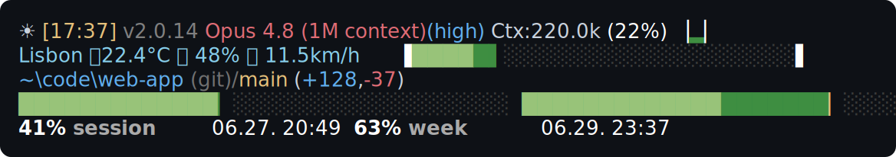
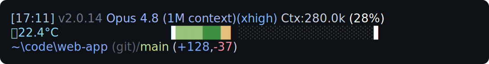
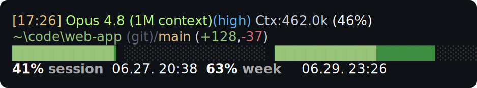

# Usage-aware Claude statusline

**A usage-aware status line for [Claude Code](https://code.claude.com)** — token usage, weekly rate-limit resets, context window, git, and weather, in a fully template-driven multi-line bar.



Most Claude Code status lines show the model and a token count. This one puts your **actual consumption** in front of you after every turn: context-window fill with a 1/8-cell-precise gauge, **session and weekly rate-limit usage with reset countdowns**, input/output/cached token counts — plus the niceties (git branch & diff, current path, live weather and sunrise/sunset). The runtime is **pure Python standard library** (no `pip install`), and a **Textual TUI editor** lets you build the layout visually.

---

## Why this one?

- 📊 **Usage-first.** Not just a token count — `{usage_bars}` / `{usage_resets}` render your **session and weekly rate-limit windows** as sized gauges with **reset-time countdowns**, and `{usage_micro}` packs them into one compact line.
- 🎯 **Context gauge with 1/8-cell precision.** `{ctx_bar}` uses Unicode eighth-blocks (`▏▎▍▌▋▊▉`) and recolors itself through token-usage bands (green → orange → red) as the window fills.
- 🧩 **Fully template-driven.** Every line is a template string with placeholders and per-element colors, edited in `statusline_config.json` — no Python edits needed.
- 🖥️ **Textual TUI editor.** Build lines from element chips, pick colors on a live spectrum, geocode a city, and see a **live preview** of the real bar before saving.
- 🪶 **Zero runtime dependencies.** The status line imports only the Python standard library; weather/usage use `urllib`. The editor is the only piece that needs a package (`textual`).
- 🌍 **Cross-platform.** macOS, Linux, and Windows (with the documented forward-slash path rule).
- ☀️ **Weather & sun, optional.** Live conditions via the free [Open-Meteo](https://open-meteo.com) API and a sunrise/sunset glyph — fetched **only** when a visible line actually uses `{weather}` or `{sun}`.

---

## Examples

Each example is a ready-to-copy config. Drop one in as `statusline_config.json` next to `statusline.py` (or point `STATUSLINE_CONFIG` at it). They vary the **text colors** and which **elements** are shown — the gauge colors are semantic (driven by fill level), so they stay consistent.

### Minimal — one line

Model + context tokens, percentage, and a micro gauge. Nothing else.


<details><summary><code>examples/minimal.json</code></summary>

```json
{
  "emoji_width": 1,
  "templates": {
    "line1": "{c.model}{model}{r}  {c.ctx_label}Ctx{r} {c.ctx_value}{ctx}{r} {c.ctx_percent}({ctx_percent}%){r} {ctx_micro}"
  },
  "colors": {
    "model": "#5BC0A8",
    "ctx_label": "#7A8290",
    "ctx_value": "#C9D2DD",
    "ctx_percent": "#ffffff"
  }
}
```
</details>

### Two lines — full weather + compact usage

Session info on top; full weather (name, icon, temp, humidity, wind) and the compact `{compact_usage_micro}` below.


<details><summary><code>examples/two-line.json</code></summary>

```json
{
  "emoji_width": 1,
  "weather": { "name": "Lisbon", "show_name": true, "show_icon": true, "show_temp": true, "show_humidity": true, "show_wind": true },
  "templates": {
    "line1": "{sun} {c.time}[{time}]{r} {c.model}{model}{r}{c.effort}{effort}{r}  {c.ctx_label}Ctx{r} {c.ctx_percent}({ctx_percent}%){r}",
    "line2": "{c.weather}{weather}{r}   {compact_usage_micro}"
  },
  "colors": {
    "time": "#F5B945",
    "model": "#E8688A",
    "effort": "#C0A8FF",
    "ctx_label": "#7A8290",
    "ctx_percent": "#ffffff",
    "weather": "#7FC8E0"
  }
}
```
</details>

### Three lines — context bar + git

Simple weather (icon + temp only), the auto-aligned big `{ctx_bar}` (here in the **orange** band as context fills up), and a git line. Cool/iceberg palette.



<details><summary><code>examples/three-line.json</code></summary>

```json
{
  "emoji_width": 1,
  "weather": { "name": "Reykjavik", "show_name": false, "show_icon": true, "show_temp": true, "show_humidity": false, "show_wind": false },
  "templates": {
    "line1": "{c.time}[{time}]{r} {c.version}{version}{r} {c.model}{model}{r}{c.effort}{effort}{r} Ctx:{ctx} {c.ctx_percent}({ctx_percent}%){r}",
    "line2": "{c.weather}{weather}{r}{align_pad}{c.ctx_bracket}▐{r}{ctx_bar}{c.ctx_bracket}▌{r}",
    "line3": "{c.path}{path}{r} {c.git_icon}(git)/{r}{c.branch}{branch}{r} ({c.output}+{added}{r},{c.input}-{removed}{r})"
  },
  "colors": {
    "time": "#A8C7E0",
    "version": "#6B7888",
    "model": "#9FB8FF",
    "effort": "#7FB4FF",
    "ctx_percent": "#ffffff",
    "weather": "#89DDFF",
    "path": "#82AAFF",
    "git_icon": "#5A6473",
    "branch": "#C3E88D",
    "output": "#82AAFF",
    "input": "#FF8FA3"
  }
}
```
</details>

### Four lines — full usage gauges

Session info, git, then the full **session + weekly** usage bars with their reset dates. Forest/green palette.



<details><summary><code>examples/four-line.json</code></summary>

```json
{
  "emoji_width": 1,
  "templates": {
    "line1": "{c.time}[{time}]{r} {c.model}{model}{r}{c.effort}{effort}{r} Ctx:{ctx} {c.ctx_percent}({ctx_percent}%){r}",
    "line2": "{c.path}{path}{r} {c.git_icon}(git)/{r}{c.branch}{branch}{r} ({c.output}+{added}{r},{c.input}-{removed}{r})",
    "line3": "{usage_bars}",
    "line4": "{usage_resets}"
  },
  "colors": {
    "time": "#E5C07B",
    "model": "#B8FF75",
    "effort": "#61AFEF",
    "ctx_percent": "#ffffff",
    "path": "#98C379",
    "git_icon": "#5A6473",
    "branch": "#E5C07B",
    "output": "#98C379",
    "input": "#E06C75"
  }
}
```
</details>

---

## Requirements

| | Needed for | Notes |
|---|---|---|
| **Python 3.7+** | the status line | Standard library only — `datetime.fromisoformat` sets the 3.7 floor. **No `pip install`.** |
| **uv** | *optional* | Convenient launcher (`uv run …`). `python3 statusline.py` works equally well. |
| **git** | *optional* | Only the `{branch}` / `(+added,-removed)` segment; degrades gracefully without it. |
| **Internet** | *optional* | Only `{weather}`/`{sun}` (Open-Meteo). Cached 10 min in `~/.claude/weather_cache.json`. |
| **`textual`** | the TUI editor only | `pip install textual`. The status line itself stays dependency-free. |
| **Truecolor terminal** | rendering | 24-bit color + an emoji-capable Unicode font. Nerd Fonts are **not** required. |

---

## Install

1. **Place the files** in your Claude Code home so any project can use them:

   ```
   ~/.claude/statusline.py
   ~/.claude/statusline_config.json     # your layout + weather location + colors
   ~/.claude/claude_usage.py            # usage/rate-limit fetcher (used by {usage_*})
   ~/.claude/statusline_editor.py       # optional TUI editor
   ```

2. **Wire it into Claude Code** with a `statusLine` block in your `settings.json`:

   ```jsonc
   "statusLine": {
     "type": "command",
     "command": "uv run ~/.claude/statusline.py",
     "padding": 0
   }
   ```

   - **macOS / Linux:** `uv run ~/.claude/statusline.py` (or `python3 ~/.claude/statusline.py`).
   - **Windows:** `uv run ~/.claude/statusline.py`. **Use forward slashes or `~`, never backslashes** — Claude Code runs the command through Git Bash (or PowerShell), and `C:\Users\…` gets mangled. The drive form `/c/Users/<you>/.claude/statusline.py` also works. With no Git Bash installed, use a PowerShell wrapper: `powershell -NoProfile -File C:/Users/<you>/.claude/statusline.ps1`.

> A guided cross-platform installer is planned as a **skill** (OS + `uv`/`python` detection, run-location choice, `settings.json` wiring, token-source setup) — see [Skills](#skills-planned).

### Usage / rate-limit data (token source)

The `{usage_*}` segments authenticate with your Claude Code OAuth token, looked up in this order (no token is ever written to disk):

1. `CLAUDE_CODE_OAUTH_TOKEN` environment variable (any OS)
2. **macOS** login Keychain (`Claude Code-credentials`), read via `/usr/bin/security` — auto-detected
3. `~/.claude/.credentials.json` (`claudeAiOauth.accessToken`) — Linux / Windows / headless

If no token is found, the usage segments simply render empty; the rest of the bar still works.

---

## Configuration

`statusline.py` reads **`statusline_config.json` from its own directory** (or the path in `STATUSLINE_CONFIG`). If the file is missing or invalid, built-in defaults are used so the bar always renders. Keys starting with `_` (e.g. `_comment`) are ignored.

```jsonc
{
  "weather": {
    "name": "Newyork", "latitude": 56.25, "longitude": -5.2833,
    "show_name": true, "show_icon": true, "show_temp": true,
    "show_humidity": true, "show_wind": true
  },
  "templates": {
    "line1": "{sun} {c.time}[{time}]{r} {c.model}{model}{r} Ctx:{ctx} ({ctx_percent}%) {ctx_micro}",
    "line2": "{c.weather}{weather}{r}  {usage_micro}"
  },
  "emoji_width": 2,
  "ctx_bar_empty": "░",
  "colors": { "model": "#E06C75", "ctx_bar": "#98C379" }
}
```

- **`templates`** — one entry per line, printed in order (`line1`, `line2`, …, up to 10). **Remove or disable a line to hide it** (the editor stores disabled lines as `_disabled_*`, which the renderer ignores).
- **`weather`** — city label + coordinates for Open-Meteo. The five `show_*` booleans pick which parts of `{weather}` appear. Look up coordinates at [open-meteo.com](https://open-meteo.com), any map, or the editor's **Look up coordinates** action.
- **`emoji_width`** — terminal columns per emoji, `1` or `2` (default `2`). Affects only line-to-bar alignment; set `1` if emoji render single-width and the bar looks shifted.
- **`ctx_bar_empty`** — glyph for the gauge's unfilled cells (default `░`); any single-column character.
- **`colors`** — per-key `#RRGGBB` overrides. Omitted keys keep their default; invalid values are ignored.

### Template placeholders

| Placeholder | Renders |
|---|---|
| `{c.NAME}` … `{r}` | apply a color from `colors` / reset to default |
| `{time}` | clock |
| `{version}` | Claude Code version |
| `{model}` | model display name |
| `{effort}` | thinking/effort indicator (e.g. `(high)`, `(xhigh)`) |
| `{ctx}` `{ctx_percent}` | context tokens used / used-percentage |
| `{ctx_bar}` | context gauge, **auto-sized** to align under line1 (1/8-cell precision) |
| `{ctx_bar:N}` | context gauge, **fixed** at N cells (ignores line1; no `{align_pad}`) |
| `{ctx_micro}` | micro context gauge — `▕<cell>▏` |
| `{align_pad}` | leading spaces so a bare `{ctx_bar}` lines up under line1 |
| `{total}` `{input}` `{output}` `{cached}` | token counts (total / input / output / cache-read) |
| `{usage_bars}` | **session + weekly rate-limit gauges**, sized to the bar width |
| `{usage_resets}` | reset-time line for the usage gauges |
| `{usage_micro}` | compact usage — one segment per gauge: `<label> <pct>%▕<cell>▏(~time)` |
| `{compact_usage_micro}` | even more compact usage micro-bars (`s 41%▕▃▏(~3h)  w 63%▕▅▏(~2d)`) |
| `{path}` `{branch}` `{added}` `{removed}` | current dir / git branch / lines added / removed |
| `{weather}` `{sun}` | weather string / sunrise-sunset glyph |
| `{peak_label}` | _legacy, off by default_ — former peak-hour cost indicator. Anthropic [removed Claude Code peak-hour limits on 2026-05-06](https://www.anthropic.com/news/higher-limits-spacex), so this segment is no longer meaningful; the `get_peak_label()` code stays in place, add `{peak_label}` to a line if you still want it. |

**Context-bar color bands** (by token usage): `ctx_bar` (≤150K) → `ctx_bar_mid` (150–250K) → `ctx_bar_high` (250–300K) → `ctx_bar_crit` (300–500K) → `ctx_bar_max` (500K+); the empty track uses `ctx_bar_track`. Flank the bar with `{c.ctx_bracket}▐` … `▌{r}`.

---

## The TUI editor

```bash
pip install textual
python ~/.claude/statusline_editor.py
```

A keyboard-driven Textual UI that edits `statusline_config.json` as rows of **element chips** (the raw `{c.NAME}…{r}` plumbing is hidden), with a 2D color picker, a city **geocoder**, and a **live preview** of the real bar from your unsaved changes. Nothing is written until **Ctrl+S**. Full key reference: [`statusline_editor_README.md`](statusline_editor_README.md).

---

## Skills (planned)

> 🚧 **Roadmap.** These ship in-repo under `.claude/skills/` so you can configure the status line by *talking to Claude* — complementing (not replacing) the TUI editor.

- **`config`** — guided multiple-choice setup: which lines/elements you want, usage display style, weather city (geocoded) and which parts, sun on/off, colors. Shows a diff and writes `statusline_config.json`.
- **`theme`** — bundled popular palettes (Catppuccin, Dracula, Nord, Gruvbox, Tokyo Night, One Dark, Solarized, …); apply a whole palette, recolor specific elements, or snap existing colors to the nearest palette color.
- **`install`** — cross-platform setup: detect OS + `uv`/`python`, choose where to run from, wire up `settings.json`, set the usage token source, and verify with a test render.
- **`preview`** *(optional)* — render a config against sample input and export an **SVG** (the same pipeline that produced the screenshots above).
- **`doctor`** *(optional)* — diagnose a blank bar: validate the config, check the token source, and test-render.

---

## Troubleshooting / FAQ

**How do I show token usage / cost in the Claude Code status line?**
Use the `{usage_bars}`, `{usage_resets}`, and `{usage_micro}` placeholders, and make sure a token source is available (see [Usage data](#usage--rate-limit-data-token-source)).

**The status line is blank on Windows.**
Your `command` path almost certainly uses backslashes. Use forward slashes or `~` (e.g. `~/.claude/statusline.py` or `/c/Users/<you>/.claude/statusline.py`).

**The context bar looks horizontally shifted.**
Your terminal renders emoji single-width — set `"emoji_width": 1` in the config.

**No weather appears.**
Weather is fetched only when a *visible* line uses `{weather}` or `{sun}`, and needs the city coordinates set. Offline, it falls back to the 10-minute cache, then to a blank weather line.

**Do I need Nerd Fonts?**
No — templates use the ASCII `(git)/` label plus standard emoji. You do need a 24-bit truecolor terminal.

---

## How it compares

Other Claude Code status lines (ccstatusline, claude-powerline, CCometixLine) focus on powerline segments and themes; `ccusage` reports usage separately. This project's niche is bringing **rate-limit / usage visualization into the bar itself**, with a dependency-free Python runtime and a visual TUI editor.

---

## Contributing

Issues and PRs welcome. The repo is English-only (code, comments, docs). The status-line runtime must stay standard-library-only; editor-only dependencies go with the editor.

## License

[IDGAFPL](LICENSE.md) — the "I Don't Give A Fuck Public License." Do what the fuck you want.

<!-- SEO: suggested GitHub topics — claude-code, claude-code-statusline, statusline, status-line, token-usage, rate-limit, context-window, anthropic, tui, textual, uv, ccusage-alternative -->
<!-- Screenshots are SVG (examples/*.svg), rendered from the real statusline.py with sample data; they use "Agave Nerd Font" with a generic monospace fallback. Swap to PNG if you want pixel-identical rendering everywhere. -->
