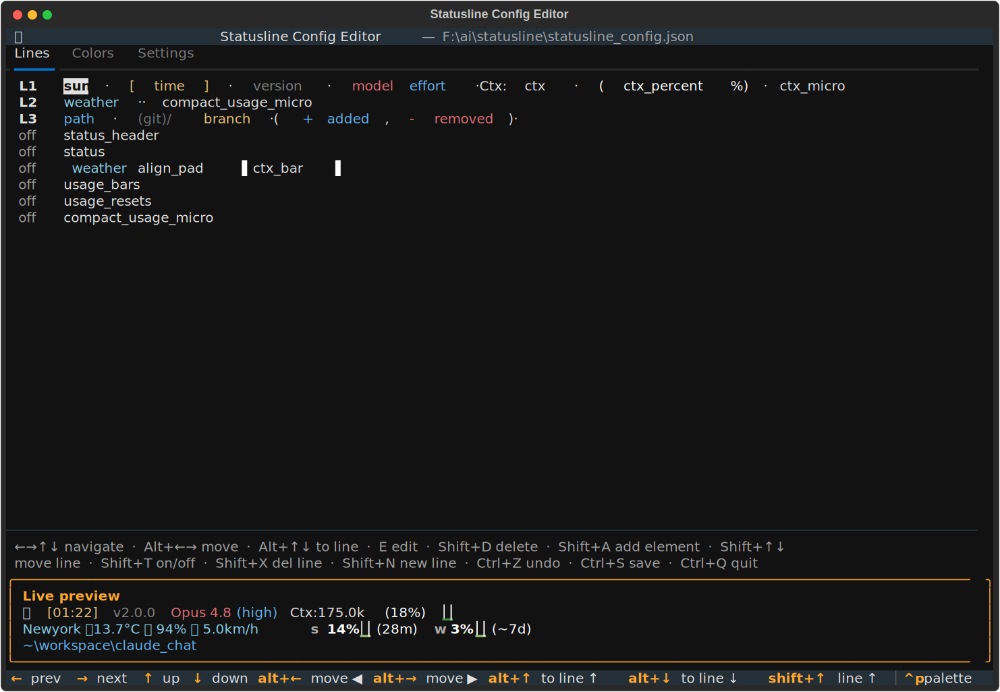
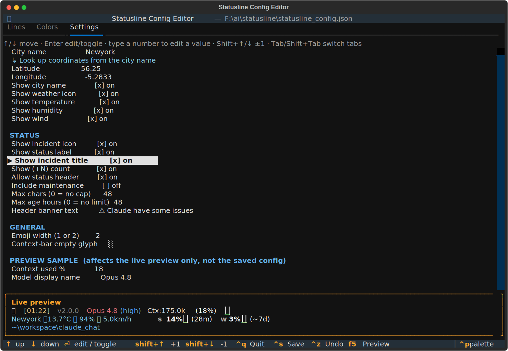

# Statusline Config Editor (TUI)

A Textual-based terminal UI for editing `~/.claude/statusline_config.json` — the
file that drives `statusline.py`. Manage template lines, insert/parameterize
placeholders, pick colors with a live swatch, tweak settings, and see a **live
preview** of the real statusline before saving.



*Lines tab — template lines as colored element chips, with a live preview of the real bar pinned at the bottom.*



*Settings tab — keyboard-driven settings, here scrolled to the STATUS section (the Claude status-page incident indicator).*

## Install & run

```bash
pip install textual
python ~/.claude/statusline_editor.py
```

The statusline itself stays dependency-free; only this editor needs `textual`.
Nothing is written to `statusline_config.json` until you press **Ctrl+S**.

## Switching tabs

The three tabs (**Lines / Colors / Settings**) are switched **only** with
`Tab` / `Shift+Tab`. The tab strip never takes keyboard focus itself — the active
tab's content (the "bottom block") is always focused, so arrows, `Enter`, etc. go
straight to the list you're looking at.

## Tabs

- **Lines** — each line is a row of **element chips**. An element is a placeholder
  (e.g. `ctx`, `usage_micro`, `status`, `status_icon`, `status_header`) or a bit of
  literal text, and it carries its own **color** — the raw `{c.NAME}...{r}` plumbing
  is hidden. Spaces show as `·`, the selected element is highlighted. Fully
  keyboard-driven (a context-sensitive key legend showing only what's available now
  sits right under the lines):

  `{status}` accepts an optional fixed-width N param (same UI as `ctx_bar`: press
  `E` / `Enter` on the chip to set it, giving `{status:N}`). `{status_icon}` and
  `{status_header}` take no param.

  | Key | Action |
  |-----|--------|
  | `←` `→` `↑` `↓` | navigate between elements / lines |
  | `Alt`+`←`/`→` | move the selected element within its line |
  | `Alt`+`↑`/`↓` | move the selected element to the line above / below |
  | `Shift`+`↑`/`↓` | move the whole line up / down |
  | `Shift`+`A` | add an element (after the selected one, else at line end) |
  | `Shift`+`D` | delete the selected element (asks first) |
  | `E` / `Enter` | edit the element — for **text** its literal + color (colors shown in their own color); for `ctx_bar` its fixed width |
  | `Shift`+`N` | new line · `Shift`+`X` delete line (asks) · `Shift`+`T` on/off |
  | `Ctrl`+`Z` | undo — every change is undoable |

  Adding a line and adding an element are **separate** actions.
- **Colors** — every color key with its hex and a live swatch.
  - `Enter` opens the **color picker**: a 2D **rainbow spectrum** (hue across,
    lightness down) you can **click with the mouse** or move over with `←→↑↓`, plus
    R/G/B boxes for fine-tuning (`↑/↓` ±1, `PgUp/PgDn` ±10 on the focused box) and a
    hex box. Live swatch + sample text update as you go.
  - `a` add a custom color key · `d` delete one.
- **Settings** — a keyboard-driven list (no input boxes). `↑`/`↓` move the
  selection; `Enter` edits a value, toggles a boolean, or runs an action; `Space`
  toggles a boolean. On a **numeric** row just start **typing a number** and the
  editor pops up pre-seeded — for the float fields a `,` is accepted and converted
  to `.` — and `Shift`+`↑`/`↓` nudges the value by ±1.
  - **Weather** (its own section): city `name`, `latitude`, `longitude`, an
    **↳ Look up coordinates** action that **geocodes** the city name via Open-Meteo
    (pick from the matches if there are several), and five **show_\*** toggles that
    pick which parts of the `{weather}` string appear — city name, weather icon,
    temperature, humidity, wind.
  - **Status**: `show_icon`, `show_label`, `show_title`, `show_count`, `show_header`
    toggles; `include_maintenance` toggle; `max_len` and `max_age_hours` numeric
    fields; `title` text field (the bold banner text for `{status_header}`). These
    drive whether and how `{status}` and `{status_header}` render.
  - **General**: `emoji_width` (1 or 2), `ctx_bar_empty` glyph.
  - **Preview sample**: context `%` and model name — these change only the live
    preview, never the saved config.

  Weather is only requested by `statusline.py` when an active line actually uses
  `{weather}` or `{sun}`; toggling all the show_\* off (or removing the weather
  placeholders) means no network call is made at all.

## Live preview

The bottom panel renders the actual statusline from your *unsaved* changes by
running `statusline.py` with the `STATUSLINE_CONFIG` env var pointed at a temp
file. Usage/weather data comes from the normal caches, so it reflects reality.
Press `F5` to force a refresh.

## Save / quit

- `Ctrl+S` — validates all colors against `#RRGGBB`, then writes the file:
  `_comment`s are preserved, active lines are renumbered `line1..lineN` in order,
  and disabled lines are stored as `_disabled_*` (the convention `statusline.py`
  ignores when rendering).
- `Ctrl+Q` — quits (prompts if there are unsaved changes).

## How it ties into statusline.py

`statusline.py` reads its config from `STATUSLINE_CONFIG` if set, otherwise the
`statusline_config.json` next to it. Only `templates` keys starting with `line`
are rendered; `_`-prefixed keys are ignored — which is exactly how lines are
"disabled".
